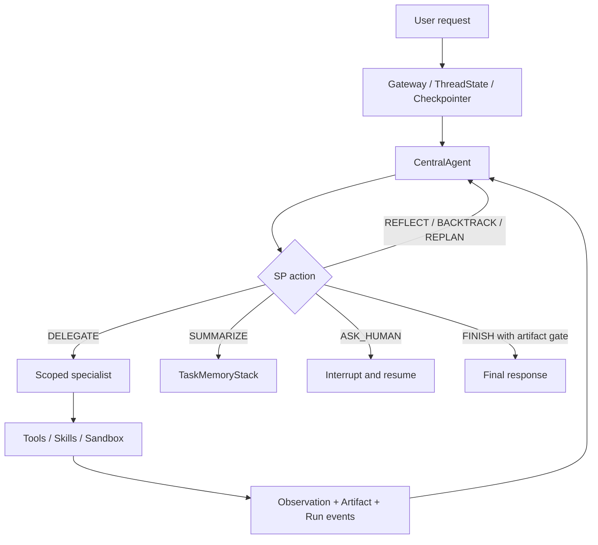

# StackPlanner 2.0 (SP2.0)

[](./backend/pyproject.toml)
[](./Makefile)
[](https://github.com/bytedance/deer-flow)
[](./LICENSE)

StackPlanner 2.0 is a long-horizon agent harness that combines a planning-first
CentralAgent with DeerFlow 2.0's production runtime. The CentralAgent reasons in
an action space, maintains bounded task memory, delegates tool and Skill use to
scoped sub-agents, verifies artifacts, and can reflect, backtrack, replan,
summarize, or ask for human help before finishing.

SP2.0 是基于 DeerFlow 2.0 Runtime 构建的长时任务智能体框架。它保留
StackPlanner 的中枢规划、反思回退和记忆栈设计，同时复用 DeerFlow 的
Gateway、ThreadState、Checkpoint、Artifact、Sandbox、Subagent 与 Web UI。

> [!IMPORTANT]
> This repository is a research and engineering fork built on DeerFlow 2.0. It
> does not include deployment credentials, private experiment traces, or hosted
> model keys. Configure providers locally through `.env` and `config.yaml`.

## Why SP2.0

SP2.0 separates **decision making** from **tool execution**:

- The CentralAgent selects actions and evaluates progress, but does not directly
  search the web, run shell commands, or manipulate files.
- Researcher, Coder, Reporter, Outline, Perception, and Memory Recaller
  specialists receive bounded contexts and role-specific tools.
- Short-term task memory stores high-value control information; large research,
  reports, code, charts, and generated files live as versioned Artifacts.
- Human feedback is pinned at critical priority and survives ordinary context
  compaction.
- Partial or blocked sub-agent results cannot silently pass as completed work.



## Core Capabilities

### Action-oriented CentralAgent

The planner combines continuous reasoning with explicit control actions:
`THINK`, `DELEGATE`, `RECALL_MEMORY`, `REFLECT`, `BACKTRACK`, `REPLAN`,
`SUMMARIZE`, `ASK_HUMAN`, and `FINISH`. Schemas, idempotency keys, run-local
guards, and completion gates provide deterministic safety without reducing every
task to a rigid workflow.

### Three-layer memory

| Layer      | Purpose                                                            | Implementation                                  |
| ---------- | ------------------------------------------------------------------ | ----------------------------------------------- |
| Short-term | Current decisions, observations, corrections, and feedback         | `TaskMemoryStack` + bounded prompt context      |
| Mid-term   | Subtask state, reports, code, files, versions, and recovery points | Artifact lineage + ThreadState + Checkpointer   |
| Long-term  | Cross-thread preferences and reusable experience                   | DeerFlow Memory + explicit recall + SOUL/Skills |

The summarizer compresses selected short-term stack entries rather than the
long-term memory store. Corrections can invalidate stale conclusions, and pinned
human feedback is protected from ordinary prune/condense operations.

### Delegation and recovery

- Independent specialist tasks may run concurrently with deterministic state
  merging and live progress/token reporting.
- Tool and Skill calls remain visible in the subtask timeline.
- Search has per-turn, parallel, duplicate, and repeated-failure budgets.
- Uploaded files are preferred over redundant network retrieval.
- Incomplete specialists receive bounded corrective attempts; unresolved gaps
  are surfaced instead of looping until the graph recursion limit.

### Evidence-grounded reports

Substantial reports can use an adaptive
Perception → Outline → Research/Implementation → Reporter flow. Reporter is a
synthesis-only specialist: it consumes materialized evidence, preserves sources
and pinned feedback, exposes missing evidence, and creates complete versioned
Markdown revisions. `FINISH` requires the exact current report Artifact rather
than a research note or an unregistered filesystem path.

### Artifacts, sandbox, and multimodal delivery

Generated code, websites, charts, images, video, reports, and multi-file bundles
are retained as run Artifacts with preview/download metadata. Coder specialists
can use scoped execution tools, while host bash remains disabled by default for
untrusted local runs. PDF/image perception and generated media depend on the
configured model/provider capabilities.

### Qwen and vLLM support

The custom vLLM adapter supports Qwen reasoning controls and recovers Qwen
`<tool_call>` blocks when a vLLM deployment does not expose them through the
standard OpenAI tool-call field. Deterministic tests cover streaming and
non-streaming action parsing.

## Repository Layout

| Path                                           | Contents                                                                           |
| ---------------------------------------------- | ---------------------------------------------------------------------------------- |
| `backend/packages/harness/deerflow/sp/`        | CentralAgent, action router, handlers, memory stack, context builder, and runtime  |
| `backend/packages/harness/deerflow/subagents/` | Specialist execution, limits, progress, and result normalization                   |
| `backend/app/gateway/`                         | Authentication, threads, runs, uploads, artifacts, and LangGraph-compatible routes |
| `frontend/`                                    | Next.js workspace, task timeline, artifacts, memory, and human interaction UI      |
| `skills/public/stackplanner-*`                 | Long-task and report synthesis workflows                                           |
| `backend/tests/` and `frontend/tests/`         | Runtime, memory, artifact, UI, and regression coverage                             |

## Project Status and Boundaries

- The primary report deliverable is Markdown; PDF/Word/PPT require a separate
  conversion or generation stage.
- Reporter cannot independently browse or execute code. Upstream specialists
  must materialize the required evidence and calculations.
- Long evidence bodies are bounded and may be marked as truncated.
- Long-term memory promotion is deliberately conservative; deployments should
  review their persistence and privacy policy before enabling automatic writes.
- Model behavior remains probabilistic even when artifact and action invariants
  are enforced in code.

The rest of this README documents setup and the inherited DeerFlow runtime
features used by SP2.0.

## One-Line Agent Setup

If you use Claude Code, Codex, Cursor, Windsurf, or another coding agent, you can hand it the setup instructions in one sentence:

```text
Help me clone StackPlanner2 if needed, then bootstrap it for local development by following the Quick Start section in this README.
```

That prompt is intended for coding agents. It tells the agent to clone the repo if needed, choose Docker when available, and stop with the exact next command plus any missing config the user still needs to provide.

## Quick Start

### Configuration

1. **Clone the StackPlanner2 repository**

   ```bash
   git clone https://github.com/PKU-SIS/StackPlanner2.git
   cd StackPlanner2
   ```

2. **Run the setup wizard**

   From the project root directory (`StackPlanner2/`), run:

   ```bash
   make setup
   ```

   This launches an interactive wizard that guides you through choosing an LLM provider, optional web search, and execution/safety preferences such as sandbox mode, bash access, and file-write tools. It generates a minimal `config.yaml` and writes your keys to `.env`. Takes about 2 minutes.

   The wizard also lets you configure an optional web search provider, or skip it for now.

   Run `make doctor` at any time to verify your setup and get actionable fix hints.
   If you are opening a GitHub issue about a local setup or runtime problem, run
   `make support-bundle`. The command prints reporter next steps, writes a
   `*-issue-summary.md` file to paste into the issue, a `*-issue-draft.md` file
   for AI-assisted issue filing, and an optional evidence zip under
   `.deer-flow/support-bundles/`. If an AI assistant files the issue, start from
   the draft and replace every REQUIRED placeholder instead of inventing missing
   facts. Attach the zip only if a maintainer asks for it, or if the summary
   alone is not enough. Maintainers and AI triage tools can start with
   `triage.json`; the bundle includes redacted diagnostics and file manifests
   only, and does not include `.env`, raw conversation messages, or user file
   contents.

   > **Advanced / manual configuration**: If you prefer to edit `config.yaml` directly, run `make config` instead to copy the full template. See `config.example.yaml` for the complete reference including CLI-backed providers (Codex CLI, Claude Code OAuth), OpenRouter, Responses API, and more.

   <details>
   <summary>Manual model configuration examples</summary>

   ```yaml
   models:
     - name: gpt-4o
       display_name: GPT-4o
       use: langchain_openai:ChatOpenAI
       model: gpt-4o
       api_key: $OPENAI_API_KEY

     - name: openrouter-gemini-2.5-flash
       display_name: Gemini 2.5 Flash (OpenRouter)
       use: langchain_openai:ChatOpenAI
       model: google/gemini-2.5-flash-preview
       api_key: $OPENROUTER_API_KEY
       base_url: https://openrouter.ai/api/v1

     - name: gpt-5-responses
       display_name: GPT-5 (Responses API)
       use: langchain_openai:ChatOpenAI
       model: gpt-5
       api_key: $OPENAI_API_KEY
       use_responses_api: true
       output_version: responses/v1

     - name: qwen3-32b-vllm
       display_name: Qwen3 32B (vLLM)
       use: deerflow.models.vllm_provider:VllmChatModel
       model: Qwen/Qwen3-32B
       api_key: $VLLM_API_KEY
       base_url: http://localhost:8000/v1
       supports_thinking: true
       when_thinking_enabled:
         extra_body:
           chat_template_kwargs:
             enable_thinking: true
   ```

   OpenRouter and similar OpenAI-compatible gateways should be configured with `langchain_openai:ChatOpenAI` plus `base_url`. If you prefer a provider-specific environment variable name, point `api_key` at that variable explicitly (for example `api_key: $OPENROUTER_API_KEY`).

   To route OpenAI models through `/v1/responses`, keep using `langchain_openai:ChatOpenAI` and set `use_responses_api: true` with `output_version: responses/v1`.

   For vLLM 0.19.0, use `deerflow.models.vllm_provider:VllmChatModel`. For Qwen-style reasoning models, DeerFlow toggles reasoning with `extra_body.chat_template_kwargs.enable_thinking` and preserves vLLM's non-standard `reasoning` field across multi-turn tool-call conversations. Legacy `thinking` configs are normalized automatically for backward compatibility. Reasoning models may also require the server to be started with `--reasoning-parser ...`. If your local vLLM deployment accepts any non-empty API key, you can still set `VLLM_API_KEY` to a placeholder value.

   CLI-backed provider examples:

   ```yaml
   models:
     - name: gpt-5.4
       display_name: GPT-5.4 (Codex CLI)
       use: deerflow.models.openai_codex_provider:CodexChatModel
       model: gpt-5.4
       supports_thinking: true
       supports_reasoning_effort: true

     - name: claude-sonnet-4.6
       display_name: Claude Sonnet 4.6 (Claude Code OAuth)
       use: deerflow.models.claude_provider:ClaudeChatModel
       model: claude-sonnet-4-6
       max_tokens: 4096
       supports_thinking: true
   ```

   - Codex CLI reads `~/.codex/auth.json`
   - Claude Code accepts `CLAUDE_CODE_OAUTH_TOKEN`, `ANTHROPIC_AUTH_TOKEN`, `CLAUDE_CODE_CREDENTIALS_PATH`, or `~/.claude/.credentials.json`
   - ACP agent entries are separate from model providers — if you configure `acp_agents.codex`, point it at a Codex ACP adapter such as `npx -y @zed-industries/codex-acp`
   - On macOS, export Claude Code auth explicitly if needed:

   ```bash
   eval "$(python3 scripts/export_claude_code_oauth.py --print-export)"
   ```

   API keys can also be set manually in `.env` (recommended) or exported in your shell:

   ```bash
   OPENAI_API_KEY=your-openai-api-key
   TAVILY_API_KEY=your-tavily-api-key
   ```

   </details>

### Running the Application

#### Deployment Sizing

Use the table below as a practical starting point when choosing how to run DeerFlow:

| Deployment target                        | Starting point                    | Recommended        | Notes                                                                                                      |
| ---------------------------------------- | --------------------------------- | ------------------ | ---------------------------------------------------------------------------------------------------------- |
| Local evaluation / `make dev`            | 4 vCPU, 8 GB RAM, 20 GB free SSD  | 8 vCPU, 16 GB RAM  | Good for one developer or one light session with hosted model APIs. `2 vCPU / 4 GB` is usually not enough. |
| Docker development / `make docker-start` | 4 vCPU, 8 GB RAM, 25 GB free SSD  | 8 vCPU, 16 GB RAM  | Image builds, bind mounts, and sandbox containers need more headroom than pure local dev.                  |
| Long-running server / `make up`          | 8 vCPU, 16 GB RAM, 40 GB free SSD | 16 vCPU, 32 GB RAM | Preferred for shared use, multi-agent runs, report generation, or heavier sandbox workloads.               |

- These numbers cover DeerFlow itself. If you also host a local LLM, size that service separately.
- Linux plus Docker is the recommended deployment target for a persistent server. macOS and Windows are best treated as development or evaluation environments.
- If CPU or memory usage stays pinned, reduce concurrent runs first, then move to the next sizing tier.

#### Option 1: Docker (Recommended)

**Development** (hot-reload, source mounts):

```bash
make docker-init    # Pull sandbox image (only once or when image updates)
make docker-start   # Start services (auto-detects sandbox mode from config.yaml)
```

`make docker-start` starts `provisioner` only when `config.yaml` uses provisioner mode (`sandbox.use: deerflow.community.aio_sandbox:AioSandboxProvider` with `provisioner_url`).

Docker builds use the upstream `uv` registry by default. If you need faster mirrors in restricted networks, export `UV_INDEX_URL=https://pypi.tuna.tsinghua.edu.cn/simple` and `NPM_REGISTRY=https://registry.npmmirror.com` before running `make docker-init` or `make docker-start`.

Backend processes automatically pick up `config.yaml` changes on the next config access, so model metadata updates do not require a manual restart during development.

> [!TIP]
> On Linux, if Docker-based commands fail with `permission denied while trying to connect to the Docker daemon socket at unix:///var/run/docker.sock`, add your user to the `docker` group and re-login before retrying. See [CONTRIBUTING.md](CONTRIBUTING.md#linux-docker-daemon-permission-denied) for the full fix.

**Production** (builds images locally, mounts runtime config and data):

```bash
make up     # Build images and start all production services
make down   # Stop and remove containers
```

Access: http://localhost:2026

For persistent deployments, configure `database.backend` as `sqlite` or
`postgres`. The selected backend is shared by the LangGraph checkpointer,
LangGraph Store, and DeerFlow application data. The deprecated `checkpointer`
section, when present, overrides the first two for backward compatibility.

The unified nginx endpoint is same-origin by default and does not emit browser CORS headers. If you run a split-origin or port-forwarded browser client, set `GATEWAY_CORS_ORIGINS` to comma-separated exact origins such as `http://localhost:3000`; the Gateway then applies the CORS allowlist and matching CSRF origin checks.

> [!IMPORTANT]
> The Gateway still owns active run tasks in process, so production defaults to a single Gateway worker (`GATEWAY_WORKERS=1`). The Redis stream bridge (`stream_bridge.type: redis`) shares SSE delivery and `Last-Event-ID` replay across workers, with a rolling retained-buffer TTL (`stream_ttl_seconds`) as a cleanup safety net. It does not make run cancellation, request de-duplication, or IM channel state fully cross-worker by itself; use single-worker Gateway or explicit sticky routing/ownership before raising `GATEWAY_WORKERS`.

See [CONTRIBUTING.md](CONTRIBUTING.md) for detailed Docker development guide.

#### Option 2: Local Development

If you prefer running services locally:

Prerequisite: complete the "Configuration" steps above first (`make setup`). `make dev` requires a valid `config.yaml` in the project root. Set `DEER_FLOW_PROJECT_ROOT` to define that root explicitly, or `DEER_FLOW_CONFIG_PATH` to point at a specific config file. Runtime state defaults to `.deer-flow` under the project root and can be moved with `DEER_FLOW_HOME`; skills default to `skills/` under the project root and can be moved with `DEER_FLOW_SKILLS_PATH`. Run `make doctor` to verify your setup before starting.
On Windows, run the local development flow from Git Bash. Native `cmd.exe` and PowerShell shells are not supported for the bash-based service scripts, and WSL is not guaranteed because some scripts rely on Git for Windows utilities such as `cygpath`.

1. **Check prerequisites**:

   ```bash
   make check  # Verifies Node.js 22+, pnpm, uv, nginx
   ```

2. **Install dependencies**:

   ```bash
   make install  # Install backend + frontend dependencies + pre-commit hooks
   ```

3. **(Optional) Pre-pull sandbox image**:

   ```bash
   # Recommended if using Docker/Container-based sandbox
   make setup-sandbox
   ```

4. **(Optional) Load sample memory data for local review**:

   ```bash
   python scripts/load_memory_sample.py
   ```

   This copies the sample fixture into the default local runtime memory file so reviewers can immediately test `Settings > Memory`.
   See [backend/docs/MEMORY_SETTINGS_REVIEW.md](backend/docs/MEMORY_SETTINGS_REVIEW.md) for the shortest review flow.

5. **Start services**:

   ```bash
   make dev
   ```

6. **Access**: http://localhost:2026

#### Startup Modes

DeerFlow runs the agent runtime inside the Gateway API. Development mode enables hot-reload; production mode uses a pre-built frontend.

|          | **Local Foreground**                         | **Local Daemon**                                             | **Docker Dev**                                      | **Docker Prod**                     |
| -------- | -------------------------------------------- | ------------------------------------------------------------ | --------------------------------------------------- | ----------------------------------- |
| **Dev**  | `./scripts/serve.sh --dev`<br/>`make dev`    | `./scripts/serve.sh --dev --daemon`<br/>`make dev-daemon`    | `./scripts/docker.sh start`<br/>`make docker-start` | —                                   |
| **Prod** | `./scripts/serve.sh --prod`<br/>`make start` | `./scripts/serve.sh --prod --daemon`<br/>`make start-daemon` | —                                                   | `./scripts/deploy.sh`<br/>`make up` |

| Action      | Local                                       | Docker Dev                                        | Docker Prod                                |
| ----------- | ------------------------------------------- | ------------------------------------------------- | ------------------------------------------ |
| **Stop**    | `./scripts/serve.sh --stop`<br/>`make stop` | `./scripts/docker.sh stop`<br/>`make docker-stop` | `./scripts/deploy.sh down`<br/>`make down` |
| **Restart** | `./scripts/serve.sh --restart [flags]`      | `./scripts/docker.sh restart`                     | —                                          |

Gateway owns `/api/langgraph/*` and translates those public LangGraph-compatible paths to its native `/api/*` routers behind nginx.

#### Docker Production Deployment

`deploy.sh` supports building and starting separately:

```bash
# One-step (build + start)
deploy.sh

# Two-step (build once, start later)
deploy.sh build              # build all images
deploy.sh start              # start pre-built images

# Stop
deploy.sh down
```

### Advanced

#### Sandbox Mode

DeerFlow supports multiple sandbox execution modes:

- **Local Execution** (runs sandbox code directly on the host machine)
- **Docker Execution** (runs sandbox code in isolated Docker containers)
- **Docker Execution with Kubernetes** (runs sandbox code in Kubernetes pods via provisioner service)

For Docker development, service startup follows `config.yaml` sandbox mode. In Local/Docker modes, `provisioner` is not started.

See the [Sandbox Configuration Guide](backend/docs/CONFIGURATION.md#sandbox) to configure your preferred mode.

#### MCP Server

DeerFlow supports configurable MCP servers and skills to extend its capabilities.
For HTTP/SSE MCP servers, OAuth token flows are supported (`client_credentials`, `refresh_token`).
For stdio MCP servers, per-tool call timeouts can be configured with `tool_call_timeout`.
See the [MCP Server Guide](backend/docs/MCP_SERVER.md) for detailed instructions.

#### IM Channels

DeerFlow supports receiving tasks from messaging apps. Channels auto-start when configured — no public IP required for any of them.

DeerFlow can also expose user-owned IM channel connections in the workspace UI. When `channel_connections` is enabled, logged-in users can bind Telegram, Slack, Discord, Feishu/Lark, DingTalk, WeChat, or WeCom from the sidebar / Settings > Channels. It reuses the existing outbound `channels.*` transports, so no public IP or provider callback URL is required. Incoming IM messages then run under the connected DeerFlow user account. See [IM Channel Connections](backend/docs/IM_CHANNEL_CONNECTIONS.md) for setup and security notes.

| Channel       | Transport                    | Difficulty |
| ------------- | ---------------------------- | ---------- |
| Telegram      | Bot API (long-polling)       | Easy       |
| Slack         | Socket Mode                  | Moderate   |
| Feishu / Lark | WebSocket                    | Moderate   |
| WeChat        | Tencent iLink (long-polling) | Moderate   |
| WeCom         | WebSocket                    | Moderate   |
| DingTalk      | Stream Push (WebSocket)      | Moderate   |

**Configuration in `config.yaml`:**

```yaml
channels:
  # LangGraph-compatible Gateway API base URL (default: http://localhost:8001/api)
  langgraph_url: http://localhost:8001/api
  # Gateway API URL (default: http://localhost:8001)
  gateway_url: http://localhost:8001

  # Optional: global session defaults for all mobile channels
  session:
    assistant_id: lead_agent # or a custom agent name; custom agents are routed via lead_agent + agent_name
    config:
      recursion_limit: 100
    context:
      thinking_enabled: true
      is_plan_mode: false
      subagent_enabled: false

  feishu:
    enabled: true
    app_id: $FEISHU_APP_ID
    app_secret: $FEISHU_APP_SECRET
    # domain: https://open.feishu.cn       # China (default)
    # domain: https://open.larksuite.com   # International

  wecom:
    enabled: true
    bot_id: $WECOM_BOT_ID
    bot_secret: $WECOM_BOT_SECRET

  slack:
    enabled: true
    bot_token: $SLACK_BOT_TOKEN # xoxb-...
    app_token: $SLACK_APP_TOKEN # xapp-... (Socket Mode)
    allowed_users: [] # empty = allow all

  telegram:
    enabled: true
    bot_token: $TELEGRAM_BOT_TOKEN
    allowed_users: [] # empty = allow all

  wechat:
    enabled: false
    bot_token: $WECHAT_BOT_TOKEN
    ilink_bot_id: $WECHAT_ILINK_BOT_ID
    qrcode_login_enabled: true # optional: allow first-time QR bootstrap when bot_token is absent
    allowed_users: [] # empty = allow all
    polling_timeout: 35
    state_dir: ./.deer-flow/wechat/state
    max_inbound_image_bytes: 20971520
    max_outbound_image_bytes: 20971520
    max_inbound_file_bytes: 52428800
    max_outbound_file_bytes: 52428800

    # Optional: per-channel / per-user session settings
    session:
      assistant_id: mobile-agent # custom agent names are also supported here
      context:
        thinking_enabled: false
      users:
        "123456789":
          assistant_id: vip-agent
          config:
            recursion_limit: 150
          context:
            thinking_enabled: true
            subagent_enabled: true

  dingtalk:
    enabled: true
    client_id: $DINGTALK_CLIENT_ID # Client ID of your DingTalk application
    client_secret: $DINGTALK_CLIENT_SECRET # Client Secret of your DingTalk application
    allowed_users: [] # empty = allow all
    card_template_id: "" # Optional: AI Card template ID for streaming typewriter effect
```

Notes:

- `assistant_id: lead_agent` calls the default LangGraph assistant directly.
- If `assistant_id` is set to a custom agent name, DeerFlow still routes through `lead_agent` and injects that value as `agent_name`, so the custom agent's SOUL/config takes effect for IM channels.
- IM channel workers call Gateway's LangGraph-compatible API internally and automatically attach process-local internal auth plus the CSRF cookie/header pair required for thread and run creation.

Set the corresponding API keys in your `.env` file:

```bash
# Telegram
TELEGRAM_BOT_TOKEN=123456789:ABCdefGHIjklMNOpqrSTUvwxYZ

# Slack
SLACK_BOT_TOKEN=xoxb-...
SLACK_APP_TOKEN=xapp-...

# Feishu / Lark
FEISHU_APP_ID=cli_xxxx
FEISHU_APP_SECRET=your_app_secret

# WeChat iLink
WECHAT_BOT_TOKEN=your_ilink_bot_token
WECHAT_ILINK_BOT_ID=your_ilink_bot_id

# WeCom
WECOM_BOT_ID=your_bot_id
WECOM_BOT_SECRET=your_bot_secret

# DingTalk
DINGTALK_CLIENT_ID=your_client_id
DINGTALK_CLIENT_SECRET=your_client_secret
```

**Telegram Setup**

1. Chat with [@BotFather](https://t.me/BotFather), send `/newbot`, and copy the HTTP API token.
2. Set `TELEGRAM_BOT_TOKEN` in `.env` and enable the channel in `config.yaml`.

**Slack Setup**

1. Create a Slack App at [api.slack.com/apps](https://api.slack.com/apps) → Create New App → From scratch.
2. Under **OAuth & Permissions**, add Bot Token Scopes: `app_mentions:read`, `chat:write`, `im:history`, `im:read`, `im:write`, `files:write`.
3. Enable **Socket Mode** → generate an App-Level Token (`xapp-…`) with `connections:write` scope.
4. Under **Event Subscriptions**, subscribe to bot events: `app_mention`, `message.im`.
5. Set `SLACK_BOT_TOKEN` and `SLACK_APP_TOKEN` in `.env` and enable the channel in `config.yaml`.

**Feishu / Lark Setup**

1. Create an app on [Feishu Open Platform](https://open.feishu.cn/) → enable **Bot** capability.
2. Add permissions: `im:message`, `im:message.p2p_msg:readonly`, `im:resource`.
3. Under **Events**, subscribe to `im.message.receive_v1` and select **Long Connection** mode.
4. Copy the App ID and App Secret. Set `FEISHU_APP_ID` and `FEISHU_APP_SECRET` in `.env` and enable the channel in `config.yaml`.

**WeChat Setup**

1. Enable the `wechat` channel in `config.yaml`.
2. Either set `WECHAT_BOT_TOKEN` in `.env`, or set `qrcode_login_enabled: true` for first-time QR bootstrap.
3. When `bot_token` is absent and QR bootstrap is enabled, watch backend logs for the QR content returned by iLink and complete the binding flow.
4. After the QR flow succeeds, DeerFlow persists the acquired token under `state_dir` for later restarts.
5. For Docker Compose deployments, keep `state_dir` on a persistent volume so the `get_updates_buf` cursor and saved auth state survive restarts.

**WeCom Setup**

1. Create a bot on the WeCom AI Bot platform and obtain the `bot_id` and `bot_secret`.
2. Enable `channels.wecom` in `config.yaml` and fill in `bot_id` / `bot_secret`.
3. Set `WECOM_BOT_ID` and `WECOM_BOT_SECRET` in `.env`.
4. Make sure backend dependencies include `wecom-aibot-python-sdk`. The channel uses a WebSocket long connection and does not require a public callback URL.
5. The current integration supports inbound text, image, and file messages. Final images/files generated by the agent are also sent back to the WeCom conversation.

**DingTalk Setup**

1. Create a DingTalk application in the [DingTalk Developer Console](https://open.dingtalk.com/) and enable **Robot** capability.
2. Set the message receiving mode to **Stream Mode** in the robot configuration page.
3. Copy the `Client ID` and `Client Secret`, set `DINGTALK_CLIENT_ID` and `DINGTALK_CLIENT_SECRET` in `.env`, and enable the channel in `config.yaml`.
4. _(Optional)_ To enable streaming AI Card replies (typewriter effect), create an **AI Card** template on the [DingTalk Card Platform](https://open.dingtalk.com/document/dingstart/typewriter-effect-streaming-ai-card), then set `card_template_id` in `config.yaml` to the template ID. You also need to apply for the `Card.Streaming.Write` and `Card.Instance.Write` permissions.

When DeerFlow runs in Docker Compose, IM channels execute inside the `gateway` container. In that case, do not point `channels.langgraph_url` or `channels.gateway_url` at `localhost`; use container service names such as `http://gateway:8001/api` and `http://gateway:8001`, or set `DEER_FLOW_CHANNELS_LANGGRAPH_URL` and `DEER_FLOW_CHANNELS_GATEWAY_URL`.

**Commands**

Once a channel is connected, you can interact with DeerFlow directly from the chat:

| Command   | Description              |
| --------- | ------------------------ |
| `/new`    | Start a new conversation |
| `/status` | Show current thread info |
| `/models` | List available models    |
| `/memory` | View memory              |
| `/help`   | Show help                |

> Messages without a command prefix are treated as regular chat — DeerFlow creates a thread and responds conversationally.

#### Request Trace Correlation

Gateway request trace correlation is disabled by default so existing HTTP responses and log formats stay unchanged. To enable it, set:

```yaml
logging:
  enhance:
    enabled: true
    format: text
```

When enabled, every Gateway HTTP response includes `X-Trace-Id`, logs include `trace_id`, and Langfuse traces created by that request include `metadata.deerflow_trace_id` with the same value.

#### LangSmith Tracing

DeerFlow has built-in [LangSmith](https://smith.langchain.com) integration for observability. When enabled, all LLM calls, agent runs, and tool executions are traced and visible in the LangSmith dashboard.

Add the following to your `.env` file:

```bash
LANGSMITH_TRACING=true
LANGSMITH_ENDPOINT=https://api.smith.langchain.com
LANGSMITH_API_KEY=lsv2_pt_xxxxxxxxxxxxxxxx
LANGSMITH_PROJECT=xxx
```

#### Langfuse Tracing

DeerFlow also supports [Langfuse](https://langfuse.com) observability for LangChain-compatible runs.

Add the following to your `.env` file:

```bash
LANGFUSE_TRACING=true
LANGFUSE_PUBLIC_KEY=pk-lf-xxxxxxxxxxxxxxxx
LANGFUSE_SECRET_KEY=sk-lf-xxxxxxxxxxxxxxxx
LANGFUSE_BASE_URL=https://cloud.langfuse.com
```

If you are using a self-hosted Langfuse instance, set `LANGFUSE_BASE_URL` to your deployment URL.

**Trace correlation fields.** Every agent run is annotated with Langfuse's reserved trace attributes so the Sessions and Users pages light up automatically:

- `session_id` = LangGraph `thread_id` — groups every trace of the same conversation
- `user_id` = effective user from `get_effective_user_id()` (falls back to `default` in no-auth mode)
- `trace_name` = assistant id (defaults to `lead-agent`)
- `tags` = `[env:<DEER_FLOW_ENV>, model:<model_name>]` (omitted when not set)
- `metadata.deerflow_trace_id` = DeerFlow request correlation id, matching `X-Trace-Id` when request trace correlation is enabled

These are injected into `RunnableConfig.metadata` at the graph invocation root for both the gateway path (`runtime/runs/worker.py::run_agent`) and the embedded path (`client.py::DeerFlowClient.stream`), so any LangChain-compatible callback can read them. Set `DEER_FLOW_ENV` (or `ENVIRONMENT`) to tag traces by deployment environment.

#### Using Both Providers

If both LangSmith and Langfuse are enabled, DeerFlow attaches both tracing callbacks and reports the same model activity to both systems.

If a provider is explicitly enabled but missing required credentials, or if its callback fails to initialize, DeerFlow fails fast when tracing is initialized during model creation and the error message names the provider that caused the failure.

For Docker deployments, tracing is disabled by default. Set `LANGSMITH_TRACING=true` and `LANGSMITH_API_KEY` in your `.env` to enable it.

## From Deep Research to Super Agent Harness

DeerFlow started as a Deep Research framework — and the community ran with it. Since launch, developers have pushed it far beyond research: building data pipelines, generating slide decks, spinning up dashboards, automating content workflows. Things we never anticipated.

That told us something important: DeerFlow wasn't just a research tool. It was a **harness** — a runtime that gives agents the infrastructure to actually get work done.

So we rebuilt it from scratch.

DeerFlow 2.0 is no longer a framework you wire together. It's a super agent harness — batteries included, fully extensible. Built on LangGraph and LangChain, it ships with everything an agent needs out of the box: a filesystem, memory, skills, sandbox-aware execution, and the ability to plan and spawn sub-agents for complex, multi-step tasks.

Use it as-is. Or tear it apart and make it yours.

## Core Features

### Skills & Tools

Skills are what make DeerFlow do _almost anything_.

A standard Agent Skill is a structured capability module — a Markdown file that defines a workflow, best practices, and references to supporting resources. DeerFlow ships with built-in skills for research, report generation, slide creation, web pages, image and video generation, and more. But the real power is extensibility: add your own skills, replace the built-in ones, or combine them into compound workflows.

Skills are loaded progressively — only when the task needs them, not all at once. This keeps the context window lean and makes DeerFlow work well even with token-sensitive models.

Users can explicitly activate an enabled skill for a single turn by starting the request with `/skill-name`, for example `/data-analysis analyze uploads/foo.csv`. DeerFlow loads that skill's `SKILL.md` as hidden current-turn context while leaving the base prompt limited to skill metadata. Slash activation respects disabled skills, custom-agent skill whitelists, and existing channel commands such as `/new` and `/help`.

When you install `.skill` archives through the Gateway, DeerFlow accepts standard optional frontmatter metadata such as `version`, `author`, and `compatibility` instead of rejecting otherwise valid external skills.

Skill installs and agent-managed skill edits run through **SkillScan**, a native deterministic safety scanner before the LLM-based skill scanner. Phase 1 runs offline with no Semgrep/OpenGrep dependency, blocks high-confidence `CRITICAL` findings such as private keys or shell execution, and passes warning findings to the LLM scanner for contextual review. Set `skill_scan.enabled: false` in `config.yaml` to disable only the deterministic analyzers; safe archive extraction and the LLM scanner still run.

Tools follow the same philosophy. DeerFlow comes with a core toolset — web search, web fetch, rendered web capture, file operations, bash execution — and supports custom tools via MCP servers and Python functions. Swap anything. Add anything.

Gateway-generated follow-up suggestions now normalize both plain-string model output and block/list-style rich content before parsing the JSON array response, so provider-specific content wrappers do not silently drop suggestions.

The Web UI composer can polish draft input before sending. The rewrite runs as a short Gateway LLM request using the `input_polish` model configuration, keeps slash skill prefixes such as `/data-analysis`, and only replaces the local draft after the user clicks the polish button; it does not create a thread run or persist a message.

Interrupted first-turn runs still persist a fallback conversation title, so stopping a streaming response does not leave the thread as "Untitled" after refresh.

In the Web UI, completed assistant turns can be branched into a new main conversation. The new thread starts from that turn's checkpoint. Because workspace files are not checkpointed, the branch only receives a best-effort copy of the current workspace when you branch from the latest turn; branching from an older turn keeps just the restored message history so the branch never inherits files that were created in a later part of the conversation.

```
# Paths inside the sandbox container
/mnt/skills/public
├── research/SKILL.md
├── report-generation/SKILL.md
├── slide-creation/SKILL.md
├── web-page/SKILL.md
└── image-generation/SKILL.md

/mnt/skills/custom
└── your-custom-skill/SKILL.md      ← yours
```

#### Claude Code Integration

The `claude-to-deerflow` skill lets you interact with a running DeerFlow instance directly from [Claude Code](https://docs.anthropic.com/en/docs/claude-code). Send research tasks, check status, manage threads — all without leaving the terminal.

**Install the skill**:

```bash
npx skills add https://github.com/bytedance/deer-flow --skill claude-to-deerflow
```

Then make sure DeerFlow is running (default at `http://localhost:2026`) and use the `/claude-to-deerflow` command in Claude Code.

**What you can do**:

- Send messages to DeerFlow and get streaming responses
- Choose execution modes: flash (fast), standard, pro (planning), ultra (sub-agents)
- Check DeerFlow health, list models/skills/agents
- Manage threads and conversation history
- Upload files for analysis

**Environment variables** (optional, for custom endpoints):

```bash
DEERFLOW_URL=http://localhost:2026            # Unified proxy base URL
DEERFLOW_GATEWAY_URL=http://localhost:2026    # Gateway API
DEERFLOW_LANGGRAPH_URL=http://localhost:2026/api/langgraph  # LangGraph API
```

See [`skills/public/claude-to-deerflow/SKILL.md`](skills/public/claude-to-deerflow/SKILL.md) for the full API reference.

### Session Goals

Use `/goal <completion condition>` to attach one active completion condition to the current thread. The goal is thread-scoped state, not a skill activation, so it stays active across turns until DeerFlow determines it has been satisfied or you clear it.

Supported commands:

```text
/goal finish the implementation and make all tests pass
/goal              # show the active goal
/goal clear        # clear it
```

After each Gateway-backed run, DeerFlow evaluates the visible conversation against the active goal with a non-thinking evaluator model. The evaluator must return a typed blocker (`missing_evidence`, `needs_user_input`, `run_failed`, `external_wait`, or `goal_not_met_yet`) plus visible evidence. DeerFlow only injects a hidden continuation when the latest assistant turn is durably checkpointed, the blocker is `goal_not_met_yet`, the thread did not change during evaluation, and the no-progress breaker has not fired. The safety cap defaults to 8 hidden continuations, and repeated identical non-progress evaluations stop after 2 attempts. `/goal clear` and any user-authored new input win over queued continuations. When the goal is satisfied, DeerFlow clears it automatically and publishes the updated thread state.

The Web UI shows the active goal above the composer. The same command is available from the TUI and supported IM channels. In the Web UI and supported IM channels, setting `/goal <completion condition>` also starts a run with the condition as the task; status and clear commands only manage goal state.

### Manual Context Compaction

Use `/compact` in the Web UI composer to summarize older context for the current thread. DeerFlow keeps the full chat visible, but future model calls use the compacted summary plus recent messages. The command is ignored when there is not enough history to compact, and it is blocked while the thread has a run in flight.

### Sub-Agents

Complex tasks rarely fit in a single pass. DeerFlow decomposes them.

The lead agent can spawn sub-agents on the fly — each with its own scoped context, tools, and termination conditions. Sub-agents run in parallel when possible, report back structured results, and the lead agent synthesizes everything into a coherent output. The subtask card streams and persists their step timeline; while a sub-agent runs `web_search` or `image_search`, the collapsed status and expanded timeline show the current query using the same safe query-only wording as a top-level tool call. When token usage tracking is enabled, completed sub-agent usage is attributed back to the dispatching step.

This is how DeerFlow handles tasks that take minutes to hours: a research task might fan out into a dozen sub-agents, each exploring a different angle, then converge into a single report — or a website — or a slide deck with generated visuals. One harness, many hands.

SP2.0's StackPlanner mode keeps the CentralAgent at the orchestration layer: it chooses actions, maintains a short-term task-memory stack, and delegates ordinary tool or skill execution to scoped sub-agents. It selects an adaptive direct, bounded-execution, or deliberate workflow instead of forcing every request through a fixed pipeline. Deliberate work can normalize a task brief, ask one consolidated clarification, create a dependency-aware outline, execute and verify specialist stages, and request human review. Independent delegations can run concurrently with deterministic state merging and live token/progress reporting; the planner must inspect sibling results before finishing. Search execution reuses identical results and has bounded parallel, per-turn, and repeated-failure budgets, while uploaded files are preferred over redundant network retrieval. Non-report specialist recovery is capped at three attempts per role and run; an exhausted recovery returns the unresolved gap instead of continuing until the graph recursion limit. When a requested downloadable artifact is still partial or blocked, a plain-text success claim is converted into a bounded recovery delegation; after the cap it is replaced with an honest incomplete result, so natural-language termination cannot bypass artifact verification. Final deliverables are not limited to reports: generated code, websites, charts, images, video, and multi-file bundles are retained as downloadable run artifacts.

StackPlanner passes authoritative pinned feedback to every specialist outside the clipped task-memory view. It also materializes bounded task-brief bodies for Outline, outline bodies for Researcher, and outline/research/perception/data/prior-report bodies for Reporter, so stage handoffs use the source content rather than only a path or summary. Reports use an evidence-grounded Markdown workflow with source preservation, tables, supplied-image reuse, explicit limitations, version lineage, and pinned human-feedback inheritance; long reports may be written directly as unique downloadable Markdown files. Code specialists default to scoped local read/write/replace/execute tools; network tools require an explicit Central delegation. The action router corrects a mistaken Researcher delegation for self-contained exact arithmetic or exhaustive assignment/combinatorial work to Coder, while external-source requests remain with Researcher. Coder writes source separately from test execution so stdout cannot overwrite the deliverable, and combinatorial enumeration uses canonical backtracking rather than factorial full permutations. When an expected output is supplied, the coder must encode it as an assertion or exact comparison that exits non-zero on failure; merely printing an example is not verification. Common interpreter labels such as `python`, `python3`, and `node` are normalized to the sandbox `bash` execution tool instead of being treated as unavailable tools. When a coding task asks for execution, tests, or verification, a `complete` claim is accepted only when the subagent trace contains a successful execution result after the latest source edit. `sp_finish` validates both the exact selected artifact and its requested family (`report` or `generated_file`) before ending a file-producing task; a completed current-run artifact is immediately routed to that terminal action. Bounded previews of structured result files (`.txt`, `.json`, `.csv`, and similar) ground the FINISH instruction, terminal memory entry, and visible response, preventing a stale CentralAgent conclusion from contradicting the generated result.

For local Qwen/vLLM deployments, `VllmChatModel` also recovers Qwen `<tool_call>` blocks returned as ordinary reasoning/content when the vLLM server has no compatible automatic tool parser. The live StackPlanner policy check can be rerun from `backend/` with `uv run python scripts/evaluate_sp_qwen_actions.py --async-mode`; add `--thinking --scenario current_information_routes_to_research` for a focused reasoning-mode check.

### Sandbox & File System

DeerFlow doesn't just _talk_ about doing things. It has its own computer.

Each task gets its own execution environment with a full filesystem view — skills, workspace, uploads, outputs. The agent reads, writes, and edits files. It can view images and, when configured safely, execute shell commands.

After each run, DeerFlow records a workspace change summary for the run-owned `workspace` and `outputs` directories. The Web UI shows a compact "files changed" badge on the assistant turn; opening it reveals created, modified, and deleted files with text diffs when safe to display. Uploads are excluded because they are user inputs, not agent-generated changes. Large, binary, or sensitive-looking files are shown as metadata only.

Artifact responses include suitable content types for inline image, video, PDF, web, and text previews, while download responses use the generated file's basename. Demo-mode artifact paths are confined to the selected thread directory.

With `AioSandboxProvider`, shell execution runs inside isolated containers. With `LocalSandboxProvider`, file tools still map to per-thread directories on the host, but host `bash` is disabled by default because it is not a secure isolation boundary. Re-enable host bash only for fully trusted local workflows. Host bash commands have a wall-clock timeout, and long-lived processes should be started in the background with output redirected to a workspace log.

This is the difference between a chatbot with tool access and an agent with an actual execution environment.

```
# Paths inside the sandbox container
/mnt/user-data/
├── uploads/          ← your files
├── workspace/        ← agents' working directory
└── outputs/          ← final deliverables
```

### Context Engineering

**Isolated Sub-Agent Context**: Each sub-agent runs in its own isolated context. This means that the sub-agent will not be able to see the context of the main agent or other sub-agents. This is important to ensure that the sub-agent is able to focus on the task at hand and not be distracted by the context of the main agent or other sub-agents.

**Summarization**: Within a session, DeerFlow manages context aggressively — summarizing completed sub-tasks, offloading intermediate results to the filesystem, compressing what's no longer immediately relevant. This lets it stay sharp across long, multi-step tasks without blowing the context window.

**Strict Tool-Call Recovery**: When a provider or middleware interrupts a tool-call loop, DeerFlow now strips provider-level raw tool-call metadata on forced-stop assistant messages and injects placeholder tool results for dangling calls before the next model invocation. This keeps OpenAI-compatible reasoning models that strictly validate `tool_call_id` sequences from failing with malformed history errors.

### Long-Term Memory

Most agents forget everything the moment a conversation ends. DeerFlow remembers.

Across sessions, DeerFlow builds a persistent memory of your profile, preferences, and accumulated knowledge. The more you use it, the better it knows you — your writing style, your technical stack, your recurring workflows. Memory is stored locally and stays under your control.

Memory updates now skip duplicate fact entries at apply time, so repeated preferences and context do not accumulate endlessly across sessions.

## Recommended Models

DeerFlow is model-agnostic — it works with any LLM that implements the OpenAI-compatible API. That said, it performs best with models that support:

- **Long context windows** (100k+ tokens) for deep research and multi-step tasks
- **Reasoning capabilities** for adaptive planning and complex decomposition
- **Multimodal inputs** for image understanding and video comprehension
- **Strong tool-use** for reliable function calling and structured outputs

## Embedded Python Client

DeerFlow can be used as an embedded Python library without running the full HTTP services. The `DeerFlowClient` provides direct in-process access to all agent and Gateway capabilities, returning the same response schemas as the HTTP Gateway API. The HTTP Gateway also exposes `DELETE /api/threads/{thread_id}` to remove DeerFlow-managed local thread data after the LangGraph thread itself has been deleted:

```python
from deerflow.client import DeerFlowClient

client = DeerFlowClient()

# Chat
response = client.chat("Analyze this paper for me", thread_id="my-thread")

# Streaming (LangGraph SSE protocol: values, messages-tuple, end)
for event in client.stream("hello"):
    if event.type == "messages-tuple" and event.data.get("type") == "ai":
        print(event.data["content"])

# Configuration & management — returns Gateway-aligned dicts
models = client.list_models()        # {"models": [...]}
skills = client.list_skills()        # {"skills": [...]}
client.update_skill("web-search", enabled=True)
client.upload_files("thread-1", ["./report.pdf"])  # {"success": True, "files": [...]}
client.set_goal("thread-1", "finish the implementation and make all tests pass")
client.get_goal("thread-1")       # {"goal": {...}} or {"goal": None}
client.clear_goal("thread-1")
```

All dict-returning methods are validated against Gateway Pydantic response models in CI (`TestGatewayConformance`), ensuring the embedded client stays in sync with the HTTP API schemas. See `backend/packages/harness/deerflow/client.py` for full API documentation.

## Scheduled Tasks

DeerFlow now includes a first-class scheduled-task MVP in the workspace.

Current MVP capabilities:

- Manage tasks at `/workspace/scheduled-tasks`
- Choose whether each scheduled task reuses a thread or creates a fresh thread per run
- Support `once` and `cron` schedules
- Run background scheduled executions as non-interactive DeerFlow runs (`ask_clarification` is not exposed there)
- Use `skip` overlap behavior for due cron executions that collide with an active run on the same reused thread
- Pause, resume, trigger, inspect history, and delete tasks
- Execute scheduled work through the normal DeerFlow run lifecycle

Current MVP limits:

- No conversation-created `schedule_task` tool yet
- No text-only notification jobs
- No channel or GitHub dispatch targets
- No `interval` schedule type in this first cut

Enable background polling with `config.yaml -> scheduler.enabled`. Manual trigger uses the same scheduled-task resource and execution path.

## Terminal Workbench (TUI)

`deerflow` is a terminal-native workbench for people who live in the shell. It runs **embedded** over `DeerFlowClient` — no Gateway, frontend, nginx, or Docker required — while honoring the same `config.yaml`, checkpointer, skills, memory, MCP, and sandbox settings as the rest of DeerFlow.


```bash
uv pip install 'deerflow-harness[tui]'        # optional 'textual' dependency

deerflow                                      # launch the terminal UI (TTY required)
deerflow --continue                           # resume the most recent thread
deerflow --resume THREAD                      # resume a thread by id
deerflow --print "summarize this repo"        # headless one-shot answer to stdout
deerflow --json  "hello"                       # headless newline-delimited StreamEvents
```

A keyboard-driven chat surface with a streaming transcript (Markdown-rendered answers), compact tool-activity cards, a `/` slash-command palette, `/goal` goal management, `/model` and `/threads` pickers, input history, and `Esc` / `Ctrl+C` interrupt. Sessions opened in the TUI also appear in the Web UI sidebar — it writes the shared thread store under the local default user, so terminal and web stay in sync **without running the Gateway**.

See [backend/docs/TUI.md](backend/docs/TUI.md) for the full guide.

## Documentation

- [Contributing Guide](CONTRIBUTING.md) - Development environment setup and workflow
- [Configuration Guide](backend/docs/CONFIGURATION.md) - Setup and configuration instructions
- [Architecture Overview](backend/CLAUDE.md) - Technical architecture details
- [Backend Architecture](backend/README.md) - Backend architecture and API reference

## ⚠️ Security Notice

### Improper Deployment May Introduce Security Risks

DeerFlow has key high-privilege capabilities including **system command execution, resource operations, and business logic invocation**, and is designed by default to be **deployed in a local trusted environment (accessible only via the 127.0.0.1 loopback interface)**. If you deploy the agent in untrusted environments — such as LAN networks, public cloud servers, or other multi-endpoint accessible environments — without strict security measures, it may introduce security risks, including:

- **Unauthorized illegal invocation**: Agent functionality could be discovered by unauthorized third parties or malicious internet scanners, triggering bulk unauthorized requests that execute high-risk operations such as system commands and file read/write, potentially causing serious security consequences.
- **Compliance and legal risks**: If the agent is illegally invoked to conduct cyberattacks, data theft, or other illegal activities, it may result in legal liability and compliance risks.

### Security Recommendations

**Note: We strongly recommend deploying DeerFlow in a local trusted network environment.** If you need cross-device or cross-network deployment, you must implement strict security measures, such as:

- **IP allowlist**: Use `iptables`, or deploy hardware firewalls / switches with Access Control Lists (ACL), to **configure IP allowlist rules** and deny access from all other IP addresses.
- **Authentication gateway**: Configure a reverse proxy (e.g., nginx) and **enable strong pre-authentication**, blocking any unauthenticated access.
- **Network isolation**: Where possible, place the agent and trusted devices in the **same dedicated VLAN**, isolated from other network devices.
- **Stay updated**: Continue to follow DeerFlow's security feature updates.

## Contributing

We welcome contributions! Please see [CONTRIBUTING.md](CONTRIBUTING.md) for development setup, workflow, and guidelines.

Regression coverage includes Docker sandbox mode detection and provisioner kubeconfig-path handling tests in `backend/tests/`.
Backend blocking-IO diagnostics are available from the repository root with
`make detect-blocking-io`: it statically scans backend business code for
blocking IO that may run on the backend event loop, prints a concise summary,
and writes complete JSON findings to `.deer-flow/blocking-io-findings.json`.
The JSON includes compact review records with `priority`, `location`,
`blocking_call`, `event_loop_exposure`, `reason`, and `code`.
Gateway artifact serving now forces active web content types (`text/html`, `application/xhtml+xml`, `image/svg+xml`) to download as attachments instead of inline rendering, reducing XSS risk for generated artifacts.

## License

This project is open source and available under the [MIT License](./LICENSE).

## Acknowledgments

DeerFlow is built upon the incredible work of the open-source community. We are deeply grateful to all the projects and contributors whose efforts have made DeerFlow possible. Truly, we stand on the shoulders of giants.

We would like to extend our sincere appreciation to the following projects for their invaluable contributions:

- **[LangChain](https://github.com/langchain-ai/langchain)**: Their exceptional framework powers our LLM interactions and chains, enabling seamless integration and functionality.
- **[LangGraph](https://github.com/langchain-ai/langgraph)**: Their innovative approach to multi-agent orchestration has been instrumental in enabling DeerFlow's sophisticated workflows.

These projects exemplify the transformative power of open-source collaboration, and we are proud to build upon their foundations.

### Key Contributors

A heartfelt thank you goes out to the core authors of `DeerFlow`, whose vision, passion, and dedication have brought this project to life:

- **[Daniel Walnut](https://github.com/hetaoBackend/)**
- **[Henry Li](https://github.com/magiccube/)**

Your unwavering commitment and expertise have been the driving force behind DeerFlow's success. We are honored to have you at the helm of this journey.

## Star History

[](https://star-history.com/#bytedance/deer-flow&Date)
